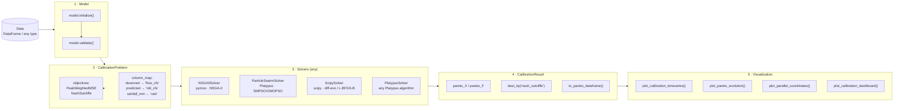

# sparsehydro

**sparsehydro** provides abstract interfaces and utilities for building *parsimonious*
(sparse-parameter) hydrological models in Python, with a focus on stormwater systems.

[](https://github.com/MSDGC-SWM/sparsehydro/actions/workflows/tests.yml)
[](https://MSDGC-SWM.github.io/sparsehydro)
[](https://pypi.org/project/sparsehydro/)
[](https://pypi.org/project/sparsehydro/)
[](LICENSE)

## Package workflow



## Features

- **Model lifecycle** — enforced six-state progression:
  `CREATED → INITIALIZED → VALIDATED → PREPARED → PREDICTED → FINALIZED`
- **Parameter registry** — named scalar and vector parameters with lower/upper bounds,
  `calibrate` flag to freeze individual parameters, normalization, and clamping
- **Flexible calibration** — `CalibrationProblem` accepts any data type via a unified
  `column_map` dict; observed targets and predicted outputs are mapped by name or callable
- **Solver-agnostic** — the same `CalibrationProblem` passes unchanged to NSGA-II (pymoo),
  PSO (Platypus SMPSO/OMOPSO), SciPy, or any custom `ISolver`
- **PyTorch support** — `ITorchModel` combines the lifecycle interface with `nn.Module`
  for gradient-based calibration
- **pandas outputs** — `predict()` returns `pd.DataFrame | pd.Series`
- **Interactive dashboards** — Plotly-based plots for Pareto evolution, parallel
  coordinates, calibration time-series with IQR bands, and multi-panel dashboards

## Installation

```bash
pip install sparsehydro
```

Optional extras:

| Extra     | Command                            | Enables                                   |
| --------- | ---------------------------------- | ----------------------------------------- |
| `rdii`    | `pip install sparsehydro[rdii]`    | RDII model (pymoo + scipy)                |
| `platypus`| `pip install sparsehydro[platypus]`| Full Platypus algorithm suite + PSO       |
| `torch`   | `pip install sparsehydro[torch]`   | Gradient-based calibration via PyTorch    |
| `docs`    | `pip install sparsehydro[docs]`    | Sphinx documentation build                |
| `all`     | `pip install sparsehydro[all]`     | All optional extras                       |

Interactive charts always require:

```bash
pip install plotly
```

## Quick start — custom model

```python
import pandas as pd
from sparsehydro import IModel, ModelState, ScalarParameter

class LinearReservoir(IModel):
    model_name = "linear-reservoir"

    def initialize(self) -> None:
        self.register_scalar_parameter(
            ScalarParameter("k", value=0.3, lower_bound=0.0, upper_bound=1.0,
                            units="1/day", description="Recession coefficient")
        )
        self._state = ModelState.INITIALIZED

    def validate(self) -> bool:
        ok = self.parameters_valid()
        if ok:
            self._state = ModelState.VALIDATED
        return ok

    def prepare(self, forcing: pd.Series) -> None:
        self._forcing = forcing
        self._state = ModelState.PREPARED

    def predict(self) -> pd.Series:
        k = self.get_scalar_parameter("k").value
        self._state = ModelState.PREDICTED
        return self._forcing * k

    def finalize(self) -> None:
        self._state = ModelState.FINALIZED


model = LinearReservoir()
model.initialize()
model.validate()
model.prepare(pd.Series([10.0, 8.0, 6.0], name="P_mm"))
print(model.predict())
model.finalize()
```

## Quick start — RDII calibration

```python
import pandas as pd
from sparsehydro.rdii import RDIIModel
from sparsehydro.calibration import (
    CalibrationProblem,
    ParticleSwarmSolver,
    PeakWeightedMSE,
    NashSutcliffe,
)
from sparsehydro.visualization import (
    plot_calibration_timeseries,
    plot_pareto_evolution,
)

# 1. Load data (datetime, rainfall_mm, flow_cfs, temperature_c)
df = pd.read_csv("events.csv", parse_dates=["datetime"])

# 2. Create and validate model
model = RDIIModel(n_triangles=3)
model.initialize()
model.validate()

# 3. Define the calibration problem via column_map
problem = CalibrationProblem(
    model=model,
    data=df,
    objectives=[PeakWeightedMSE(), NashSutcliffe()],
    column_map={
        "observed":  "flow_cfs",    # target column in data
        "predicted": "rdii_cfs",    # output column from model.predict()
    },
)

# 4. Run PSO calibration (runtime kwargs override constructor defaults)
solver = ParticleSwarmSolver(swarm_size=50, n_evaluations=5_000, seed=42)
result = solver.solve(problem)          # full run
# result = solver.solve(problem, n_evaluations=200)  # quick test override

# 5. Inspect and visualize
best_x = result.best_by("nash_sutcliffe")
print(result.to_pareto_dataframe())

fig = plot_pareto_evolution(result)
fig.show()
```

## Documentation

Full documentation is available at [cbuahin.github.io/sparsehydro](https://cbuahin.github.io/sparsehydro).

## License

MIT — see [LICENSE](LICENSE).
