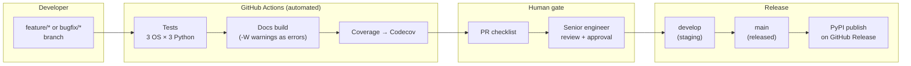
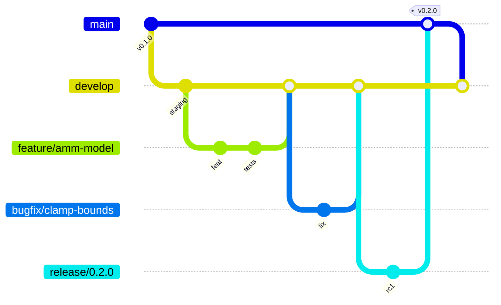
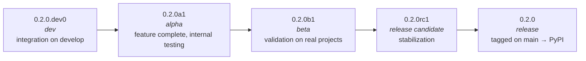
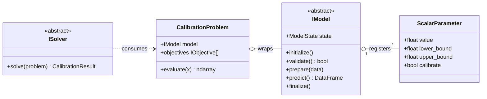
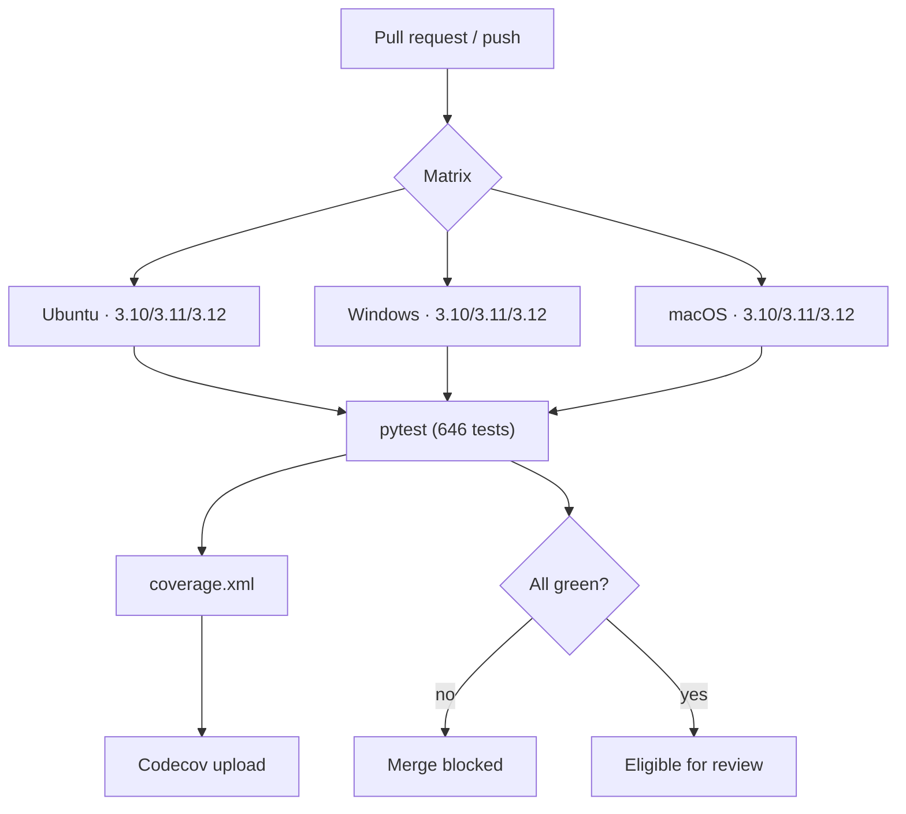
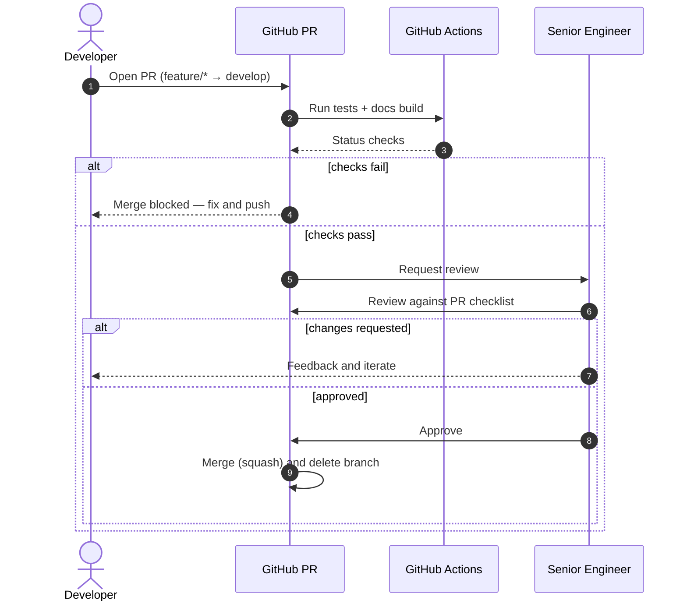

# Quality Assurance & Quality Control (QA/QC)

This document describes the QA/QC framework adopted for the development of the
**sparsehydro** package. It summarizes the engineering practices, automation, and
review controls that together ensure the package is correct, reproducible,
well-documented, and safe to release for use across multiple Hazen & Sawyer and
MSDGC projects.

The framework rests on five pillars:

1. A formal **Git branching strategy** that separates released, staged, and
   in-development code.
2. A formal **semantic versioning** scheme with `dev → alpha → beta → release`
   progression.
3. **Documented formulations and code structure** with diagrams and references to
   the source literature.
4. **Automated unit and regression testing** run by GitHub Actions on every change
   to protected branches, with broad coverage and a multi-OS / multi-Python matrix.
5. **Mandatory pull-request review** by a senior engineer, gated by a standardized
   PR checklist, before any code is merged.



---

## 1. Branching strategy

sparsehydro follows a formal, GitHub-Flow-derived branching model (a streamlined
Git Flow) so that what is *released*, what is *staged for the next release*, and
what is *in active development* are always cleanly separated.

| Branch            | Role                                  | Protected | Deploys                          |
| ----------------- | ------------------------------------- | --------- | -------------------------------- |
| `main`            | Production / released code only       | Yes       | GitHub Pages docs; PyPI on tag   |
| `develop`         | Integration / staging for next release| Yes       | GitHub Pages (preview)           |
| `feature/<name>`  | New capabilities                      | No        | —                                |
| `bugfix/<name>`   | Defect fixes against `develop`        | No        | —                                |
| `hotfix/<name>`   | Urgent fixes branched from `main`     | No        | —                                |
| `release/<x.y.z>` | Release stabilization / RC hardening  | No        | Pre-release artifacts            |

### Rules

- **`main` is always releasable.** Only `release/*` and `hotfix/*` branches merge
  into `main`, and every merge to `main` is tagged with a semantic version.
- **`develop` is the staging trunk.** Day-to-day feature and bugfix branches are
  cut from `develop` and merged back into `develop` via reviewed pull requests.
- **Short-lived topic branches.** `feature/*` and `bugfix/*` branches are scoped to
  a single change, kept short-lived, and deleted after merge.
- **Hotfixes** branch from `main`, are merged back into both `main` and `develop`,
  and trigger a patch release.



The CI workflows enforce this topology: tests and docs run on every push to
`main` and `develop` and on every pull request targeting `main`, and the PyPI
publish workflow only fires on a published GitHub Release (see
[Automated testing & CI/CD](#4-automated-testing--cicd)).

---

## 2. Semantic versioning

sparsehydro adopts [Semantic Versioning 2.0.0](https://semver.org/) (`MAJOR.MINOR.PATCH`)
with a formal pre-release progression. The current published version is **0.1.0**
and the package is classified as `Development Status :: 3 - Alpha` in
[pyproject.toml](../pyproject.toml).

| Segment       | Increment when…                                                       |
| ------------- | -------------------------------------------------------------------- |
| `MAJOR`       | Backwards-incompatible API changes (e.g. `IModel` contract changes). |
| `MINOR`       | Backwards-compatible features (new model, solver, or objective).     |
| `PATCH`       | Backwards-compatible bug fixes only.                                  |

### Pre-release channels

Releases mature through a defined sequence of pre-release identifiers before a
final release:



| Stage    | Identifier (PEP 440) | Meaning                                                       |
| -------- | -------------------- | ------------------------------------------------------------ |
| dev      | `X.Y.Z.devN`         | Active integration on `develop`; API may change daily.       |
| alpha    | `X.Y.ZaN`            | Feature-complete; internal testing; API mostly stable.       |
| beta     | `X.Y.ZbN`            | Validated against real project data; only fixes expected.    |
| rc       | `X.Y.ZrcN`           | Release candidate; documentation and changelog finalized.    |
| release  | `X.Y.Z`             | Tagged on `main`; published to PyPI; entered in CHANGELOG.    |

The package version is declared in two synchronized locations —
[`pyproject.toml`](../pyproject.toml) (`[project].version`) and
[`sparsehydro/__init__.py`](../sparsehydro/__init__.py) (`__version__`) — and every
release is recorded in [CHANGELOG.md](../CHANGELOG.md) following the
[Keep a Changelog](https://keepachangelog.com/) convention. The Python version
identifiers above conform to [PEP 440](https://peps.python.org/pep-0440/).

---

## 3. Documented formulations & code structure

Every model formulation and architectural decision is documented in version-controlled
Markdown/reStructuredText, rendered to HTML via Sphinx, and published to GitHub Pages.
Documentation is treated as a build artifact: the docs job compiles with
`sphinx-build -W --keep-going`, so **any warning (a broken cross-reference, an
undocumented symbol, a malformed directive) fails the build**.

### Documentation set

| Document                                                   | Scope                                                       |
| ---------------------------------------------------------- | ---------------------------------------------------------- |
| [DESIGN.md](../DESIGN.md)                                  | Package design: lifecycle, parameter system, `IModel` ABC. |
| [docs/rdii_design.md](./rdii_design.md)                    | Physics-based RDII / Initial-Abstraction formulation.      |
| [docs/combined_model.md](./combined_model.md)             | Configurable composite IA + unit-hydrograph model.         |
| [docs/unithydrograph_strategy.md](./unithydrograph_strategy.md) | Unit-hydrograph subpackage architecture.             |
| [docs/getting_started.rst](./getting_started.rst)         | End-to-end calibration walkthrough.                        |
| [docs/api.rst](./api.rst)                                  | Autodoc API reference with literature citations.           |

### Formulations are mathematically specified

Model equations are written out in LaTeX so reviewers can check the implementation
against the math. For example, the RDII Initial-Abstraction recovery and depletion
ODEs are documented in [docs/rdii_design.md](./rdii_design.md):

$$IA_{avail}(t+\Delta t) = IA_{max} - \bigl(IA_{max} - IA_{avail}(t)\bigr)\,e^{-k_{rec}(T)\,\Delta t}$$

### Architecture is documented with diagrams

The README and Sphinx docs include Mermaid class, flow, and sequence diagrams that
are kept in sync with the code. The core abstractions and their relationships:



### Implementations cite their sources

Documented formulations reference the peer-reviewed literature they implement so
that the modeling assumptions are traceable. Key references:

- Edgren, J., Czachorski, R., & Gonwa, W. (2024). *Antecedent Moisture Model.*
  **Journal of Water Management Modeling, 32**, C525.
  <https://doi.org/10.14796/JWMM.C525> — implemented by
  `sparsehydro.models.amm.AMMModel`.
- Nash, J. E., & Sutcliffe, J. V. (1970). River flow forecasting through conceptual
  models part I. *Journal of Hydrology, 10(3)*, 282–290 — `NashSutcliffe` objective.
- Gupta, H. V., Kling, H., Yilmaz, K. K., & Martinez, G. F. (2009). Decomposition of
  the mean squared error and NSE performance criteria. *Journal of Hydrology, 377* —
  `KGE` objective.
- Deb, K., Pratap, A., Agarwal, S., & Meyarivan, T. (2002). A fast and elitist
  multiobjective genetic algorithm: NSGA-II. *IEEE Trans. Evol. Comput., 6(2)* —
  `NSGAIISolver` (via pymoo).

---

## 4. Automated testing & CI/CD

All correctness checks are automated with **GitHub Actions** and run on every push
to `main`/`develop` and on every pull request into `main`. No change reaches a
protected branch without a green test suite.

### Test suite scope

| Metric                      | Value                                                |
| --------------------------- | ---------------------------------------------------- |
| Test functions              | **646** across **18** test modules                   |
| Frameworks                  | `pytest`, `pytest-cov`                                |
| Operating systems           | Ubuntu, Windows, macOS                                |
| Python versions             | 3.10, 3.11, 3.12                                      |
| Matrix combinations         | **9** (3 OS × 3 Python)                               |
| Coverage reporting          | `--cov-report=term-missing` + `coverage.xml` → Codecov |

The suite combines **unit tests** (parameters, enums, registry, interfaces, objectives)
with **regression tests** that pin numerical behavior of the scientific models —
e.g. `test_amm_model.py` verifies model outputs against worked examples from the
source paper, and `test_rdii_model.py` (93 tests) and
`test_calibration_comprehensive.py` (105 tests) lock down the calibration math.
Because these regression tests assert against known-good values, any unintended
change to a formulation is caught automatically.



### Workflows

| Workflow                                          | Trigger                       | Purpose                                            |
| ------------------------------------------------- | ----------------------------- | -------------------------------------------------- |
| [tests.yml](../.github/workflows/tests.yml)       | push `main`/`dev`, PR → `main`| Run the full matrix test suite; upload coverage.   |
| [docs.yml](../.github/workflows/docs.yml)         | push `main`/`dev`, PR → `main`| Build Sphinx docs with warnings-as-errors; deploy. |
| [publish.yml](../.github/workflows/publish.yml)   | GitHub Release published      | Build sdist+wheel and publish to PyPI (OIDC).      |

The publish workflow uses PyPI **trusted publishing** (OpenID Connect, `id-token: write`),
so no long-lived API tokens are stored — releases are cryptographically attributed to
the workflow run, reducing supply-chain risk.

### Coverage policy

Coverage is configured in [pyproject.toml](../pyproject.toml)
(`--cov=sparsehydro --cov-report=term-missing --cov-report=xml`) and uploaded to
Codecov from the canonical job (Ubuntu / Python 3.12). Coverage is tracked over time
and reviewers are expected to ensure new code ships with corresponding tests so that
overall coverage trends upward and core scientific modules stay well covered.

---

## 5. Pull-request review & merge gate

Code review by a **senior engineer** is a required, non-bypassable gate. Branch
protection on `main` and `develop` requires:

- ✅ All CI status checks passing (test matrix + docs build).
- ✅ At least one approving review from a designated senior engineer
  (enforced via a `CODEOWNERS` reviewer assignment).
- ✅ The branch up to date with its base before merge.
- ✅ Conversations resolved.
- 🚫 No direct pushes to protected branches — changes land only via PR.



### Pull-request checklist (template)

Every PR must complete the following checklist before it is eligible for merge.
This is maintained as a repository PR template
(`.github/PULL_REQUEST_TEMPLATE.md`) so it is pre-populated on every new PR:

```markdown
## Summary
<!-- What does this change do and why? -->

## Related issues
<!-- Closes #… -->

## Type of change
- [ ] Bug fix (non-breaking)
- [ ] New feature (non-breaking)
- [ ] Breaking change (MAJOR version bump)
- [ ] Documentation only

## QA/QC checklist
- [ ] Branch follows naming convention (`feature/*`, `bugfix/*`, `hotfix/*`).
- [ ] Targets the correct base branch (`develop` for features/bugfixes).
- [ ] New/changed behavior is covered by unit and/or regression tests.
- [ ] Full test suite passes locally (`pytest`) and in CI (all matrix legs).
- [ ] Coverage does not regress; new code is exercised by tests.
- [ ] Public API changes are reflected in docstrings and `docs/`.
- [ ] Sphinx docs build cleanly (`sphinx-build -W`).
- [ ] Formulation changes cite the relevant literature.
- [ ] Version bumped appropriately (SemVer) and `CHANGELOG.md` updated.
- [ ] No secrets, credentials, or large data files committed.

## Reviewer (senior engineer)
- [ ] Math/implementation reviewed against documented formulation.
- [ ] Test design reviewed for adequacy and correctness.
```

---

## 6. Independent validation across projects

Beyond automated tests, the package and its formulations are **independently
exercised and validated on real engineering projects**, providing a second,
domain-level verification layer outside the unit-test harness:

- **SERWS Big Sandy Model** — calibration experiments and Pareto analyses
  (`calibration.ipynb`, `chilacothe_calibration.ipynb`, `sheridan.ipynb`).
- **Southeast Ohio Regional Water Study** — regression and calibration notebooks
  (Zanesville, Chillicothe, Rio Grande) that apply the same models and solvers to
  independent datasets.
- **UnitHydrograph** — companion package exercising the unit-hydrograph formulations
  against multiple monitored sewershed datasets.
- **Example notebooks** shipped with the package
  ([`sparsehydro/notebooks/`](../sparsehydro/notebooks/)) demonstrate and sanity-check
  end-to-end workflows on representative data.

When a formulation is found to be deficient on a real project, the finding is
captured as an issue, fixed on a `bugfix/*` branch with an accompanying regression
test, and flows back through the same review and release pipeline — closing the
loop between field validation and the automated test suite.

---

## Summary

| Pillar                | Control                                                                 |
| --------------------- | ----------------------------------------------------------------------- |
| Branching             | Protected `main`/`develop`; `feature/*`, `bugfix/*`, `hotfix/*` topics.  |
| Versioning            | SemVer 2.0 with `dev → alpha → beta → rc → release` (PEP 440).           |
| Documentation         | Sphinx (warnings-as-errors) + diagrams + literature citations.          |
| Automated testing     | 646 tests, 3 OS × 3 Python matrix, coverage to Codecov, on every change. |
| Review gate           | Mandatory senior-engineer approval + standardized PR checklist.         |
| Independent validation| Real-project notebooks and companion packages cross-check formulations. |

Together these controls ensure that every change to sparsehydro is tested,
reviewed, documented, versioned, and independently validated before it reaches
users.
